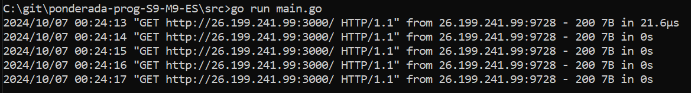
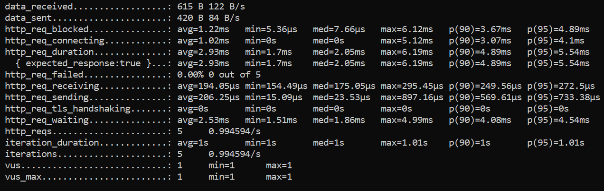
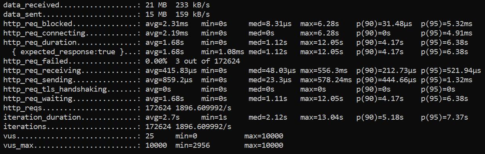
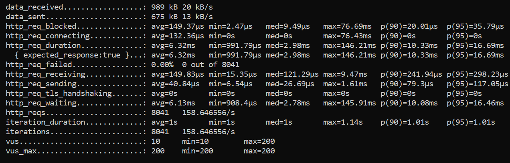

# Teste de carga utilizando o K6

Nesta atividade, realizei diversos testes de carga, em um ambiente simulado utilizando o K6. Uma [API em Go](./src/main.go) foi criada a sim de simular um ambiente real, e os diversos [testes em K6](./tests/) foram executados. 

<hr>

Para rodar os testes, utilizei o docker, com o comando:

```docker
docker run --rm -i grafana/k6 run - < tests/nome-teste.js
```

E a API com o comando:

```cmd
go run main.go
```
<br>


Imagem 1: Api ativa recebendo requisições


## Exemplo dos testes
### Smoke Test


Imagem 2: Teste de smoke

Com um usuário simulado, podemos observar que o tempo médio da duração da requisição foi de 2.93ms.

### Spike Test


Imagem 3: Teste de Spike

Com picos de 10000 usuários, podemos observar que 90% das requisições teve um tempo médio de 4.17s, e houveram apenas 3 erros de 172624 (< 0.00%).

### Stress Test


Imagem 4: Teste de Stress
Com 200 usuários simulados por 50 segundos, podemos notar que 95% das requisições teve um tempo médio de recebimento baixíssimo, de 298.23µs.

## Considerações Finais

Como esperado, serviços mais sobrecarregados tendem a apresentar maior demora e erros, quando comparado a serviços com pouca demanda. 

Além disso, a API utilizada era muito simples, uma API mais robusta, com sisteamas de fila e/ou balanceamento, lidaria bem melhor com quantidades massivas de requisições.

Desta forma, ferramentas de testes como o K6 se mostram extremamente valiosas para testar e validar hipóteses, durante a fase de desenvolvimento de um produto.

<hr>

Material fonte: 

https://dev.to/eminetto/load-testing-using-k6-57ph

https://grafana.com/docs/k6/latest/set-up/install-k6/